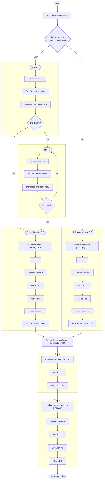

## Minor release

Used when we have new features to release.

```mermaid
flowchart TB
  classDef code font-family:monospace,font-size: 0.8em;
  
  start([Start])

  start --> co[Get latest main branch]
  co --> rc_q{Do we need a<br>release candidate?}
  rc_q -- Yes --> rc1_start
  rc_q -- No --> release_bare_start
  
  subgraph rc1 [ ]
    rc1_start([First RC])
    rc1_start --> rc1_tag[tools/tag-release.sh -m]
    rc1_tag --> rc1_wait_release[Wait for release action]
    rc1_wait_release --> rc1_test[Download and test binary]
    rc1_test --> rc1_ok{Did it work?}
    
    class rc1_tag code
  end
  
  rc1_ok -- Yes --> release_start
  rc1_ok -- No --> rcn_start
  
  subgraph rcn [ ]
    rcn_start([nth RC])
    rcn_start --> rcn_tag[tools/tag-release.sh -c]
    rcn_tag --> rcn_wait_release[Wait for release action]
    rcn_wait_release --> rcn_test[Download and test binary]
    rcn_test --> rcn_ok{Did it work?}
    rcn_ok -- No --> rcn_start
    
    class rcn_tag code
  end
  
  rcn_ok -- Yes --> release_start
  
  subgraph release [ ]
    release_start([Releasing after RC])
    release_start --> release_package_version[Update version in package.json]
    release_package_version --> release_npm[npm ci]
    release_npm --> release_pr[Create a new PR]
    release_pr --> release_ci[Wait for CI]
    release_ci --> release_merge[Merge PR]
    release_merge --> release_tag[tools/tag-release.sh -r]
    release_tag --> release_wait[Wait for release action]
    
    class release_npm,release_tag code
  end

  release_wait --> checkpoint
  
  subgraph release_bare [ ]
    release_bare_start([Releasing without RC])
    release_bare_start --> release_bare_package_version[Update version in package.json]
    release_bare_package_version --> release_bare_npm[npm ci]
    release_bare_npm --> release_bare_pr[Create a new PR]
    release_bare_pr --> release_bare_ci[Wait for CI]
    release_bare_ci --> release_bare_merge[Merge PR]
    release_bare_merge --> release_bare_tag[tools/tag-release.sh -mr]
    release_bare_tag --> release_bare_wait[Wait for release action]
    
    class release_bare_npm,release_bare_tag code
  end

  release_bare_wait --> checkpoint
  
  checkpoint[Record the new release in<br>the checkpoint UI]
  
  checkpoint --> docs_review
  
  subgraph Docs
    docs_review[Review generated docs PR]
    docs_review --> docs_ci[Wait for CI]
    docs_ci --> docs_merge[Merge docs PR]
  end
  
  docs_merge --> readme_update
  
  subgraph Readme
    readme_update[Update the version in the README]
    readme_update --> readme_pr[Create a new PR] --> readme_ci[Wait for CI] --> readme_approval[Get approval] --> readme_merge[Merge PR]
  end
    
  readme_merge --> done
  
  done([Release complete])
  
  
```

