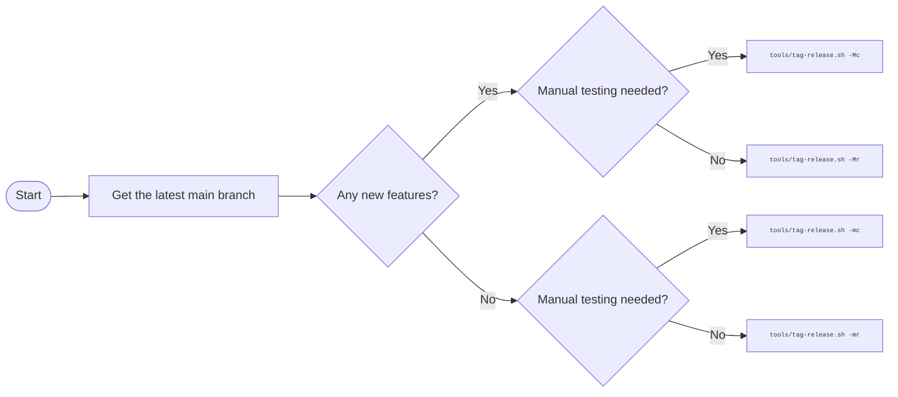

```mermaid
flowchart LR
  classDef code font-family:monospace,font-size: 0.8em;
  
  start([Start])
  start --> co
  
  co[Get the latest main branch];
  co --> features{Any new features?};
  features -- Yes --> minor_manual{Manual testing needed?};
  minor_manual -- Yes --> minor_rc[tools/tag-release.sh -Mc];
  minor_manual -- No --> minor_rl[tools/tag-release.sh -Mr];
  features -- No --> patch_manual{Manual testing needed?};
  patch_manual -- Yes --> patch_rc[tools/tag-release.sh -mc];
  patch_manual -- No --> patch_rl[tools/tag-release.sh -mr];

  class minor_rc,minor_rl,patch_rc,patch_rl code;
  
  
```
